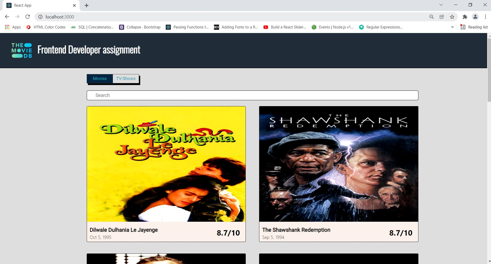
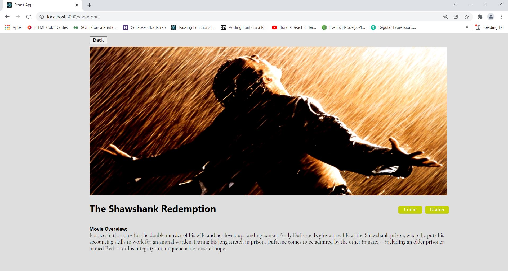

# ReactJS & react-redux - The top 10 rated TV Shows and the top 10 Movies (TheMovieDB API)

This project was bootstrapped with [Create React App](https://github.com/facebook/create-react-app).

## General Info
The app needs to have the functionalities of displaying the top 10 rated TV shows and the top 10 movies,
a search function for both, and a detail view for individual items.  
  

Use TheMovieDB API found at [https://developers.themoviedb.org/3](https://developers.themoviedb.org/3) to implement this.

The layout of home page is given by the following image:  

   

When the user clicks on a specific MOVIE/TV SHOW, he is taken to the details view as shown by following image:  

   


## Getting Started with Create React App
Create React App is a command line interface (CLI) tool that will create relatively simple, production-ready React application. There're two different ways to install your production-ready React application. To start a new Create React App project with TypeScript, you can run:
```bash
npx create-react-app my-app --template typescript

```
Once installed, you can create a new project with
```bash
create-react-app my-app
```
Whether you use your favorite package manager or the first way to do the same in a single step, creating a new application can take a few minutes, depending on the time it takes to install the dependencies on your machine.  
  
When it completes, there will be a newly created my-app directory waiting for you. To view the application, you’ll start the development server, which takes care of serving
your JavaScript code to the browser (among other things).   Navigate to my-app directory now, and run the following command at the prompt: 
```bash
npm start
```
If create-react-app didn’t open a browser window automatically after starting the development server, open a browser and head to [localhost:3000](http://localhost:3000).
Try changing the home page layout by editing the src/App.js file. You should see the browser refresh automatically, without having to reload the page.


## Requirements
* axios v0.24.0
* redux v4.1.2
* react-redux 7.2.6
* redux-thunk v2.4.1

To add listed dependencies to a package.json file from the command line, you can install them in the root directory of your package using the --save-prod flag (the default behavior of npm install).  

To add an entry to the "dependencies" attribute of a package.json file, on the command line, run the following command:  

```python
npm install <package-name> [--save-prod]
```

## Configuring The Redux Store
The main hub of functionality in Redux is the store—the object responsible for managing application state. The Redux package exports a createStore function that is used to create a Redux store. Specifically, the Redux store is an object with a few core methods that can read and update state and respond to any changes: getState, dispatch, and subscribe.  
  
To start with Redux, you need to add Redux as a dependency of the project by running the following command in a terminal window:
```bash
npm install redux
```
Now that Redux has been added, the next step is to integrate it into your existing React components. First create the store by adding the code shown in the
following listing to store.ts.
```python
import { createStore, applyMiddleware } from 'redux'
import thunk from 'redux-thunk'
import { reducer } from './reducer'

export const store = createStore(reducer, applyMiddleware(thunk));
...
```
The first argument passed to the createStore function is a reducer. The store requires at least one reducer. A reducer is a function that takes the current state of the store and an action and returns the new state after applying any updates. The second argument passed to the createStore is a middleware. Redux Thunk is middleware that allows you to return functions, rather than just actions, within Redux.  


Within the src directory, we'll create a new directory, redux, with an reducers.ts and actions.ts files. In reducers.ts file,
we’ll create and export a single function, reducer, that returns the given state, as shown in the following listing.
```python
export const reducer = (
    state: MediaState = { loading: true, searchTerm: '', displayItemIndicator: false, selectMedia: 'movies', filteredMedia: [], topRatedMedia: []}, 
    action: any) : MediaState =>{
        switch(action.type){
            case 'MAKE_REQUEST':
                return {
                    ...state,
                    loading: true
                }
            case 'GET_FILTERED_MEDIA':
                return {
                    ...state,
                    filteredMedia: action.payload,
                    loading: false
                }
            case 'GET_TOP_RATED_MEDIA':
                return {
                    ...state,
                    loading: false,
                    filteredMedia: [],
                    topRatedMedia: action.payload
                }
            case 'UPDATE_INPUT_ELEMENT':
                return{
                    ...state,
                    selectMedia: action.payload.media,
                    searchTerm: action.payload.term
                }
            case 'SET_DISPLAY_ITEM_INDICATOR':
                return {
                    ...state,
                    displayItemIndicator: action.payload.active
                }
            default:
                return state
        }

}
```
Reducers check the action's type to determine if it should respond to it. In our application we're dispatching MAKE_REQUEST, GET_TOP_RATED_MEDIA, GET_FILTERED_MEDIA, UPDATE_INPUT_ELEMENT and SET_DISPLAY_ITEM_INDICATOR actions. If the action is MAKE_REQUEST, the function reducer set loading state inside the array and return the result. At this moment, we're waiting to fetch data depending on the selected tab.  

If the action being passed in is of type GET_TOP_RATED_MEDIA and GET_FILTERED_MEDIA, the function reducer fill one array (topRatedMedia or filteredMedia) depending on the selected media with fetching data using contents of an action. The last two actions are triggered by changing input elements.
  
In actions.ts file, we'll create four action creators - functions that return an action object, fetchTopRatedMedia, fetchFilteredMedia, updateInputElement and setDisplayItemIndicator.
```python
export function fetchTopRatedMedia(media: string, term: string, bool: boolean){
    return function (dispatch: any){
        if( !term || bool){
            dispatch({type: 'MAKE_REQUEST'});
        }
        console.log(bool)
        setTimeout(async function(){
            try{
                const response = await fetch(
                    media === 'movies' ? `https://api.themoviedb.org/3/movie/top_rated?api_key=${API_KEY}` : 
                                        `https://api.themoviedb.org/3/tv/top_rated?api_key=${API_KEY}`, 
                        {method: 'get'})
                const data = await response.json();
                
                dispatch({type: 'GET_TOP_RATED_MEDIA', payload: data.results.slice(0, 10)})
            }catch(err){
                dispatch({type: 'ERROR'});
            }

        }, 500);
    }
}

export function fetchFilteredMedia(media: string, term: string){
    return function(dispatch: any){
        dispatch({type: 'MAKE_REQUEST'});
        setTimeout(async function(){
            try{
                const response = await fetch(
                    media === 'movies' ? `https://api.themoviedb.org/3/movie/top_rated?api_key=${API_KEY}` : 
                                        `https://api.themoviedb.org/3/tv/top_rated?api_key=${API_KEY}`, 
                        {method: 'get'})
                const data = await response.json();
                
                dispatch({type: 'GET_FILTERED_MEDIA', payload: data.results.slice(0, 10).filter((item: any) => item.title ? item.title.toUpperCase().includes(term.toUpperCase()) : item.original_name.toUpperCase().includes(term.toUpperCase()))})
            }catch(err){
                dispatch({type: 'ERROR'});
            }
        }, 500);
    }
}

export function updateInputElement(media: string, term: string){
    return async function(dispatch: any){
        dispatch({type: 'UPDATE_INPUT_ELEMENT', payload: {media, term}});
    }
}

export function setDisplayItemIndicator(bool: boolean){
    return function(dispatch: any){
        dispatch({type: 'SET_DISPLAY_ITEM_INDICATOR', payload: {active: bool}});
    }
}
```
### Connecting React and Redux with react-redux
To connect Redux with React, we’ll use the React bindings from the react-redux package.
react-redux gives you two primary tools for connecting your Redux store to React:
* Provider — A React component that you’ll render at the top of the React app. Any components rendered as children of Provider can be granted access to the Redux store.
* connect — A function used as a bridge between React components and data from the Redux store.  
  
Provider is a component that takes the store as a prop and wraps the top-level component in your app in this case, App. Any child component rendered within Provider can access the Redux store, no matter how deeply it’s nested. In index.js, import the Provider component and wrap the App component, using the code in the following listing.
```python
ReactDOM.render(
  <Provider store={store}> 2
    <App />
  </Provider>,
  document.getElementById('root')
);
```  

## Available Scripts

In the project directory, you can run:

### `npm start`

Runs the app in the development mode.\
Open [http://localhost:3000](http://localhost:3000) to view it in the browser.

The page will reload if you make edits.\
You will also see any lint errors in the console.

### `npm test`

Launches the test runner in the interactive watch mode.\
See the section about [running tests](https://facebook.github.io/create-react-app/docs/running-tests) for more information.

### `npm run build`

Builds the app for production to the `build` folder.\
It correctly bundles React in production mode and optimizes the build for the best performance.

The build is minified and the filenames include the hashes.\
Your app is ready to be deployed!

See the section about [deployment](https://facebook.github.io/create-react-app/docs/deployment) for more information.

### `npm run eject`

**Note: this is a one-way operation. Once you `eject`, you can’t go back!**

If you aren’t satisfied with the build tool and configuration choices, you can `eject` at any time. This command will remove the single build dependency from your project.

Instead, it will copy all the configuration files and the transitive dependencies (webpack, Babel, ESLint, etc) right into your project so you have full control over them. All of the commands except `eject` will still work, but they will point to the copied scripts so you can tweak them. At this point you’re on your own.

You don’t have to ever use `eject`. The curated feature set is suitable for small and middle deployments, and you shouldn’t feel obligated to use this feature. However we understand that this tool wouldn’t be useful if you couldn’t customize it when you are ready for it.

## Learn More

You can learn more in the [Create React App documentation](https://facebook.github.io/create-react-app/docs/getting-started).

To learn React, check out the [React documentation](https://reactjs.org/).
